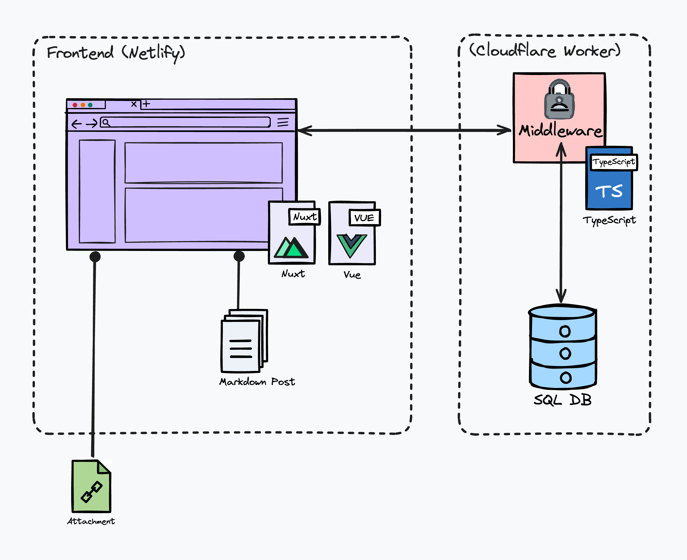

# Frontend Sito Mirandola 2 ⚜️

> ℹ️ _Il ruolo di questo file è duplice: in primis funge da documentazione per coloro che hanno creato sviluppato il sito ma hanno altresì scarsissima memoria. In secondo luogo vuole essere, anche e soprattutto, una sorta di guida per chi a prescindere dalle proprie competenze vorrebbe_ capirci qualcosa _ed è curioso di cosa tiene in piedi il “frontend” del sito del Mirandola 2. Per questa duplice natura - e nell'ottica del principio scout del Trapasso Nozioni - si è cercato di usare un linguaggio chiaro e spiegare cose che per alcuni possono essere ovvie pur sapendo che d'altra parte per forza di cose questo non potrà bastare a capire tutto tutto. Sicuramente è meglio di niente; se vorrete leggerlo, buona caccia!_

Il frontend è la parte di un sito web che è visibile dall'utente. Nel nostro caso è stata costruita usando Nuxt and Tailwind. Quest'ultimo è un framework CSS utilizzato insieme alla libreria Daisy UI per semplificare la parte di design del sito. Nuxt è invece un framework JavaScript che permette di costruite siti statici utilizzando **Vue.js**. 

I siti statici, come quelli creati con framework come Nuxt, sono siti web precompilati in pagine HTML, CSS e JavaScript che non richiedono un server attivo per generare i contenuti al momento della richiesta dell’utente. A differenza dei siti tradizionali dinamici, che generano le pagine in tempo reale, i siti statici vengono generati in anticipo, permettendo una distribuzione più semplice e una performance più elevata. 

Di seguito si può vedere l'architettura del sito.



In questa repository è presente e qui documentato il frontend, mentre il [Middleware 📤 si può trovare qui](https://github.com/mirandola2/middleware).

#### Indice
- [Introduzione](#frontend-sito-mirandola-2-)
   * [Local development 🪄](#local-development-)
   * [Content update ✏️](#content-update-)
      + [MDC syntax](#mdc-syntax)
         - [Cards & card](#cards--card)
         - [Table of contents](#table-of-contents)
         - [Figures](#figures)
            * [Caroselli](#caroselli)
         - [Quoted](#quoted)
         - [Staff](#staff)
         - [Button Link](#button-link)
      + [Front Matter](#front-matter)
      + [Menu](#menu)
   * [Staff file 👨‍👩‍👧‍👧](#staff-file-)
   * [Immagini 🖼️](#immagini-)
   * [Hosting ☁️](#hosting-)


## Local development 🪄

Per far partire il local server:

```sh
npm install
npm run dev
```

Pushando le modifiche su Github, il sito verrà automaticamente aggiornato.

## Content update ✏️

> __Premessa__: Questo paragrafo vuole essere d'aiuto per chiunque voglia modificare il sito senza avere particolari rudimenti su [Nuxt](https://nuxt.com/) o Vue. Logicamente non si è potuto inserire tutto lo scibile sull'argomento; perciò si rimanda il lettore alla documentazione ufficiale nel caso si volessero fare modifiche più profonde al sito.

I contenuti del sito sono renderizzati a partire da file presenti in due fonti:

- la cartella `content` ospita le pagine in formato [Markdown](https://markdownguide.org/cheat-sheet/). Le pagine i cui file iniziano per _ o per . sono pagine particolari con funzioni specifiche.
- la cartella `pages` ospita tutte le pagine in formato Vue oltre che il template standard standard delle pagine al punto precedente.  

I contenuti nella carta __"In primo piano"__ presente nella home sono invece modificabili dal file `content/_home.md`.

I singoli articoli della sezioni blog sono anch'esse pagine Markdown, presenti nella cartella `content/blog`

Essendo il Markdown un linguaggio estremamente comodo, si è preferito usare il più possibile la cartella `content`, lasciando nei file Vue solamente cioò che era troppo complesso per essere scritto in Markdown. Questi ultimi file vanno esclusi dal contenuto generato dinamicamente modificando il file di configurazione ([documentazione](https://content.nuxtjs.org/api/configuration#ignores)) (solo per le nuove pagine Vue create).

Si noti infine che le immagini si trovano nella cartella `public`. Si è cercato di mettere qui solo le immagini principali, compresse il più possibile, tenendo sempre a mente il fatto che la maggioranza di esse nonché i file esterni, è meglio non caricarli su GitHub (sebbene non ci sia un hard-limit allo spazio di archiviazione, Github nasce per il codice) favorendo altri cloud (Google Photos, One Drive, Google Drive, Cloudlfare Files etc.). Quando vengono linkate le immagini interne nella varie pagine, il percorso deve essere relativo al contenuto della cartella `/public`, non a `/`.

### MDC syntax

Le pagine in Markdown nella cartella `content` ammettono la sintassi MDC, ovvero un markdown "potenziato" che sfrutta componenti a blocchi. 
I blocchi possono essere utilizzati usando la seguente sintassi (Più info nella documentazione ufficiale).

```md
::<titolo>{<parametri>}
<contentuto>
::
```

I componenti si trovano nella cartella `/components/content` e attualmente sono i seguenti.

#### Cards & card

Due componenti da usare insieme, permettono di visualizzare tante _carte_ testuali in modalità galleria. Come si può vedere nell'esempio, il blocco `cards` contiene le single `card`.

```md
::cards

    :::card{title="La Legge" color="lc" big}
        Il lupetto pensa agli altri come a se stesso.  
        Il lupetto vive con gioia e lealtà insieme al branco.
    :::

    :::card{title="Il Motto" color="lc"}
        Del Nostro Meglio
    :::
::
```

I parametri di card sono:  

- `title`: stringa, opzionale, sarà visualizzato come il titolo della carta
- `color`: stringa, opzionale (lg|eg|rs|cc), rappresenta il colore della carta. Altrimenti sarà di colore neutro.
- `big`: boolean, opzionale. Se vero, la carta sarà grande il doppio su certi schermi

#### Table of contents

```md
:tableOfContents
```

Fa apparire un indice della pagina nella parte destra della pagina sui dispositivi non mobili, al centro altrimenti. Per far sì che sia a larghezza intera su tutti i dispositivi, è neccessario il parametro opzionale `notaside` sia true.

#### Figures

```md
:Fig{src='/img/misc/img.jpg' desc='La descrizione dell'immagine' float=1 alt='Immagine di esempio'}
```

Mostra un'immagine formattata usando la grafica del sito. I parametri sono:

- `src` string | Object, mandatory: source dell'immagine, interna in _public_ o esterna
- `desc` string | Object, optional: descrizione che appare sotto all'immagine
- `alt` string, optional: testo alternativo per migliorare l'accessibilità ([cos'è?](https://developer.mozilla.org/en-US/docs/Web/API/HTMLImageElement/alt))
- `float` number, optional: regola come apparirà l'immagine: `0` la farà apparire centrata e a larghezza ampia, `1` (default) la farà diventare float a sinistra, `2` float a destra.

##### Caroselli

Le proprietà `src` e `desc` possono anche avere più immagini, in modo da creare un carosello. La sintassi deve essere la seguente: 

```md
:Fig{:src='["/path0.jpg", "/path1.jpg"]' :desc='["Caption Img 0", "Caption Img 1"]' }
```

#### Quoted

```md
::quoted
...e quando Hathi, l'elefante selvaggio che vive cento anni e più, vide affiorare una lunga e sottile cresta di Roccia Azzurrina, proprio nel bel mezzo della corrente, capì che quella era la roccia della pace ed immediatamente alzò la proboscide e proclamò la "tregua dell'acqua".  
::
```

Il blocco `quoted` permette di creare una citazione.

#### Staff

```md
:staff{staff='L' coca}
```

Parametri:  

- `staff`: stringa, indica quale staff mostrare [L | C | E | G | N | CF | CC | CJ | *] (rispettivamente, lupetti, coccinelle, esploratori, guide, noviziato, clan-fuoco, coca (altri incarichi), capi gruppo, tutti). 
- `coca`: booleano, opzionale. Se vero, mostra solo i capi in CoCa.

Il blocco mostra tutti i capi di una certa staff. I capi sono inseriti in formato .csv nel file `/content/_capi.csv` rispettando la formattazione presentata in calce.


#### Button Link

Mostra il testo di un link all'interno di un bottone e con un'icona scelta fra [queste](https://fonts.google.com/icons?selected=Material+Symbols+Rounded:open_in_new:FILL@0;wght@400;GRAD@0;opsz@24&icon.platform=web&icon.style=Rounded).

```md
::Lnk{href="https://example.com" icon="checklist"}
Testo del Bottone
::
```

### Front Matter

Nei blog post come nelle pagine markdown, esiste una sezione chiamata front matter, utile a inserire proprietà e metadati. ([documentazione ufficiale](https://content.nuxt.com/usage/markdown#front-matter)).

Per quanto riguarda le pagine, il front-matter supportato è il seguente.

```md
---
title: "Titolo della pagina"
image: path/img.jpg 
overlap_hero: false #lasciare falso a meno di non voler sovrapporre leggermente il contenuto all'immagine di hero.
---
```

Per i singoli post presenti nella cartella `content/blog`, invece:  

```md
---
title: "Titolo"
img: 'path/cover.jpg'
category: 'cc' # lc | eg | rs | cc
date: 2023-10-15
---
```

### Menu

Il menu è gestito nel file `app.vue`, e in particolare nel dizionario presente nello _script setup_.

Esempio:

```js
 {
    "Home": "/",
    "Chi Siamo": {
        "L'Associazione": "/associazione",
        "Il Gruppo": "/gruppo",
        }
 }
```

## Staff file 👨‍👩‍👧‍👧

I capi sono inseriti in formato .csv nel file `/content/_capi.csv` rispettando la formattazione presentata nell'esempio seguente.

```csv
nome,nomeCaccia,ruolo,staff,coca,desc,img,order
Baden Powell,Impeesa,Fondatore dello Scoutismo|Capo Reparto,CC|E,1,Impeesa ovvero l'animale che si sposta furtivamente di notte,bp.jpg,0
```

- Da notare come il `nomeCaccia` indichi non il nome Totem ma bensì il personaggio interpretato dai capi in LC. Viene mostrato al posto del nome vero se e solo se `staff == {L, C}` e `coca==true`.
- Se nel campo `ruolo` è presente una `|`, il contenuto antecedente verrà mostrato quando `staff == *`, il contenuto successivo negli altri casi. 
- Separare i doppi incarichi con un `|` nel campo `staff`. I valori possibili sono gli stessi riportati in precedenza.
- Il campo `img` è il percorso relativo della foto del capo che si deve trovare nella cartella `/public/img/staff` (se il percorso della foto è `/public/img/staff/capo.jpg`, il campo deve essere `capo.jpg`).
- Il campo `order` è facoltativo. Se presente, in tutte le visualizzazione ``staff != *`, sovrascrive l'ordine delle righe, andando a posizionare i capi della singola staff secondo l'ordine crescente. Utile solo in caso di doppi servizi.

## Immagini 🖼️

Gestire le immagini è complicato sia per una questione di privacy sia per una questione di storage. L'attuale soluzione prevede che tutte le immagini di archivio siano caricate esternamente, in particolare sul OneDrive fornito al gruppo dall'associazione; tranne per ciò che riguarda le poche immagini presenti sul sito come immagini di copertina o simili, che per una questione di latenza si è preferito procedere diversamente. Queste caricate su GitHub. Tuttavia per evitare che queste finiscano nella git commit history (da evitare sia per motivi di best practice informatiche sia per motivi interni nostri), sono caricate come oggetti di [Git LFS](https://git-lfs.com/). 

```sh
git lfs track public/img/**/*.jpg
git add ...
git commit -m "Added images"
git push origin main
```

## Hosting ☁️

Il sito è ospitato gratuitamente su Netlify.